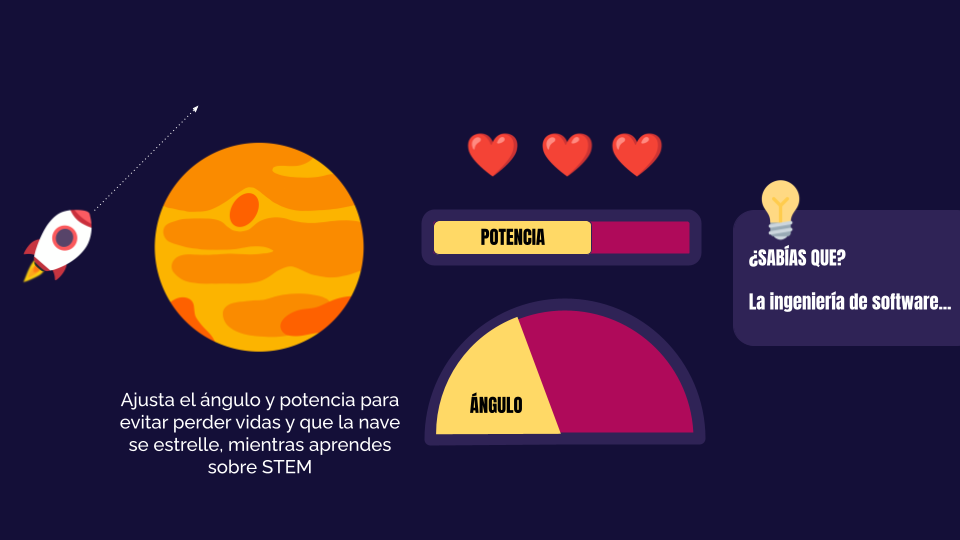

<<<<<<< HEAD
# Documento de diseño del juego

## The sTEAM:
- Lourdes Badillo, A01024232
- Valeria Pineda, A01023979
- Eduardo Villalpando, A01023646

<b>Videojuego diseñado para Movimiento STEAM </b>

# Índice
- [Diseño del Juego](#diseño-del-juego)
  * [Resumen](#resumen)
  * [Dinámica del juego](#dinámica-del-juego)
  * [Mentalidad](#mentalidad)
- [Técnico](#técnico)
  * [Pantallas](#pantallas)
  * [Controles](#controles)
- [Mecánicas](#mecánicas)
- [Diseño de niveles](#diseño-de-niveles)
  * [Temas](#temas)
  * [Características de cada nivel](#características-de-cada-nivel)
- [Desarrollo](#desarrollo)
- [Gráficos](#gráficos)
  * [Atributos del estilo](#atributos-del-estilo)
  * [Gráficos](#gráficos-1)
    + [Planetas](#planetas)
    + [Naves](#naves)
    + [Satélites artificiales](#satélites-artificiales)
    + [Satélites naturales](#satélites-naturales)
    + [Fondos espaciales](#fondos-espaciales)
- [Sonido/Música](#sonido-música)
  * [Atributos del estilo](#atributos-del-estilo-1)
  * [Sonidos requeridos](#sonidos-requeridos)
- [Calendario](#calendario)

<br> 

#  Diseño del Juego

## Resumen
Uno de los mayores logros de la humanidad ha sido llegar al espacio. En este juego, el usuario tendrá que poner naves espaciales en la órbita de distintos planetas, comprendiendo el impacto de STEM en el mundo.

## Dinámica del juego
        Se generarán niveles de forma automática en los que el jugador ajustará la potencia de la nave, así como el ángulo de su trayectoria con el objetivo de que se mantenga en órbita. Para cada nivel se variará la masa de la nave y fuerza de gravedad, y se incluirán obstáculos con el fin de que el jugador use pensamiento crítico y análisis para resolver la problemática.  

## Mentalidad
        El propósito del juego es generar interés en las ciencias, especialmente cuando están siendo aplicadas al viaje interestelar. Para esto, se tiene que estar en un estado calmado y enfocado. Al ir viviendo la dinámica del juego el jugador se sentirá inspirado con las posibilidades que abre la ciencia, con ganas de avanzar al siguiente nivel para descubrir nuevos retos y soluciones a distintos problemas. Esto se va a lograr con gráficos que llaman la atención y con niveles que van cambiando poco a poco. Estos cambios constantes, junto con pequeñas piezas de información en cada nivel, van atrapando la atención del jugador y le informan sobre las aplicaciones de diferentes ramas de la ciencia.

# Técnico

## Pantallas
1.  Pantalla título: Mostrará el puntaje del jugador, así como información del juego.
2.  Registro de usuario: Permitirá al jugador registrar datos relevantes
3.  Juego

4.  Desafío de poner un objeto en órbita: Se mostrarán los controles para interactuar, así como los planetas y objetos. Igualmente se mostrarán las vidas disponibles y la puntuación.
5.  Datos relevantes de una carrera STEM: Con botones para saber si le interesó al jugador

6.  Créditos Finales

## Controles

        TRAYECTORIA: Una flecha punteada desde la nave indicará la trayectoria de la misma. Esta puede ser ajustada utilizando las flechas izquierda y derecha en el teclado.

        POTENCIA: El usuario mantendrá presionada la tecla enter llenando una barra que representa la velocidad que tiene la nave. Cuando ésta se suelte, la nave seguirá la trayectoria establecida con la velocidad indicada.

        MENÚ: Se incluirá un menú para pausar el juego, ver el puntaje y leer información relevante.

# Mecánicas        

Física:

-   Movimiento orbital ([https://www.bbc.co.uk/bitesize/guides/zg638mn/revision/4](https://www.google.com/url?q=https://www.bbc.co.uk/bitesize/guides/zg638mn/revision/4&sa=D&source=editors&ust=1614291589977000&usg=AOvVaw3CUijghEJDNfacpGyMtOQj))
-   Movimiento circular uniforme

Reglas:

-   El jugador cuenta con tres oportunidades para poner el objeto en órbita
-   Con cada nivel varía la masa de la nave y la gravedad de cada planeta
-   Se puede ajustar el ángulo de lanzamiento y la propulsión inicial
-   Si no se logra poner la nave en órbita, esta choca contra el planeta o se va a la lejanía



# Diseño de niveles
## Temas

- Espacio
    - Mood
        - Divertido, interesante, misterioso
    - Objetos
        - Ambiente
            - Fondo oscuro
            - Estrellas, galaxias, cometas, nebulosas
        - Interactivos
            - Naves espaciales 
            - Satélites artificiales
            - Satélites naturales
            - Planetas

## Características de cada nivel
-   Objeto que se lanza: En cada nivel el jugador tiene como objetivo poner un objeto en órbita, este puede ser una nave espacial, un satélite de comunicación o incluso un satélite natural.
-   Planeta: Todos los niveles tienen un planeta para el cual varía su masa, tamaño y color.
-   Obstáculos: La dificultad de cada nivel va incrementando y se empezarán a añadir obstáculos, los cuales son otros objetos orbitantes con los que se puede hacer colisión.


# Desarrollo
Disclaimer: Esta sección la dejaremos pendiente hasta que entendamos mejor cómo usar C\# y Unity y, por lo tanto, podamos establecer las clases que requerimos para nuestro juego.

# Gráficos

## Atributos del estilo
Nos inspiramos en los gráficos que utiliza Kurzgesagt para sus vídeos, ya que estos son muy atractivos para el segmento objetivo de nuestro juego. La imagen de abajo es nuestra fuente de inspiración:


## Gráficos

### Planetas
- Distintos colores y rayas

    
    
    
    
    
    
    
    
    
    
    
<br><br>

- Con anillos

    

### Naves

- Con propulsión (fueguito)

    

- Sin propulsión

    ~ Pendiente ~

### Satélites artificiales

- Con dos páneles solares

    ~ Pendiente ~

### Satélites naturales

- Forma de papa

    ~ Pendiente ~

- Circulares

    

### Fondos espaciales

- Degradado radial

    

- Degradado vertical

    

    


# Sonido/Música

## Atributos del estilo

        Queremos incluir música de fondo, inspirándonos en el soundtrack de Interstellar, compuesta por Hans Zimmer. Esto le agregará un sentimiento de misterio. Tomar como inspiración el siguiente audio: [https://youtu.be/IqiTJK\_uzUY?t=231](https://www.google.com/url?q=https://youtu.be/IqiTJK_uzUY?t%3D231&sa=D&source=editors&ust=1614291589987000&usg=AOvVaw1QD_ZHMADao77bPACILcH2) 

## Sonidos requeridos

1.  Efectos
    -  Despegue de la nave
    - Explosión

2.  Feedback
    - Happy chime (Se logró el nivel)
    - Sad chime (Colisión o se perdió la nave)

# Calendario


1.  Definir idea del videojuego
2.  Establecer la dinámica y mecánica
3.  Elaborar ilustraciones
4.  Programar el videojuego
5.  Realizar scripts con parámetros físicos
6.  Incorporar interacciones entre objetos
7.  Incorporar interacción con el usuario
8.  Investigar y agregar datos curiosos
9.  Generar dashboard donde se muestran los datos recolectados
10.  Incluir música y efectos de sonido
=======
# Game Name Here
> Game Design Document

# Table of Content

- [Game Design](#game-design)
    - [Summary](#summary)
    - [Gameplay](#gameplay)
    - [Mindset](#mindset)
- [Technical](#technical)
    - [Screens](#screens)
    - [Controls](#controls)
    - [Mechanics](#mechanics)
- [Level Design](#level-design)
    - [Themes](#themes)
    - [Game Flow](#game-flow)
- [Development](#development)
    - [Abstract Classes / Components](#abstract-classes--components)
    - [Derived Classes / Component Compositions](#derived-classes--component-compositions)
- [Graphics](#graphics)
    - [Style Attributes](#style-attributes)
    - [Graphics Needed](#graphics-needed)
- [Sounds/Music](#soundsmusic)
    - [Style Attributes](#style-attributes-1)
    - [Sounds Needed](#sounds-needed)
    - [Music Needed](#music-needed)
- [Schedule](#schedule)


# Game Design

## Summary
Sum up your game idea in 2 sentences. A kind of elevator pitch. Keep it simple!

## Gameplay
What should the gameplay be like? What is the goal of the game, and what kind of obstacles are in 
the way? What tactics should the player use to overcome them?

## Mindset
What kind of mindset do you want to provoke in the player? Do you want them to feel powerful, or 
weak? Adventurous, or nervous? Hurried, or calm? How do you intend to provoke those emotions?

# Technical
 
## Screens

```
1. Title Screen
    a. Options
2. Level Select
3. Game
    a. Inventory
    b. Assessment / Next Level
4. End Credits
```

_(example)_

## Controls
How will the player interact with the game? Will they be able to choose the controls? What kind of 
in-game events are they going to be able to trigger, and how? (e.g. pressing buttons, opening doors, etc.)

## Mechanics
Are there any interesting mechanics? If so, how are you going to accomplish them? Physics, 
algorithms, etc.

# Level Design
 (Note : These sections can safely be skipped if they’re not relevant, or you’d rather go about it another way. For most games, at least one of them should be useful. But I’ll understand if you don’t want to use them. It’ll only hurt my feelings a little bit.)

## Themes
```
1.	Forest
    a.	Mood
        i.	Dark, calm, foreboding
    b.	Objects
        i.	Ambient
            1.	Fireflies
            2.	Beams of moonlight
            3.	Tall grass
        ii.	Interactive
            1.	Wolves
            2.	Goblins
            3.	Rocks
2.	Castle
    a.	Mood
        i.	Dangerous, tense, active
    b.	Objects
        i.	Ambient
            1.	Rodents
            2.	Torches
            3.	Suits of armor
        ii.	Interactive
            1.	Guards
            2.	Giant rats
            3.	Chests
```

_(example)_

## Game Flow
```
1.	Player starts in forest
2.	Pond to the left, must move right
3.	To the right is a hill, player jumps to traverse it (“jump” taught)
4.	Player encounters castle - door’s shut and locked
5.	There’s a window within jump height, and a rock on the ground
6.	Player picks up rock and throws at glass (“throw” taught)
7.	… etc.
```
(example)


# Development
 
## Abstract Classes / Components
```
1.	BasePhysics
    a.	BasePlayer
    b.	BaseEnemy
    c.	BaseObject
2.	BaseObstacle
3.	BaseInteractable
```
_(example)_ 

## Derived Classes / Component Compositions
```
1.	BasePlayer
    a.	PlayerMain
    b.	PlayerUnlockable
2.	BaseEnemy
    a.	EnemyWolf
    b.	EnemyGoblin
    c.	EnemyGuard (may drop key)
    d.	EnemyGiantRat
    e.	EnemyPrisoner
3.	BaseObject
    a.	ObjectRock (pick-up-able, throwable)
    b.	ObjectChest (pick-up-able, throwable, spits gold coins with key)
    c.	ObjectGoldCoin (cha-ching!)
    d.	ObjectKey (pick-up-able, throwable)
4.	BaseObstacle
    a.	ObstacleWindow (destroyed with rock)
    b.	ObstacleWall
    c.	ObstacleGate (watches to see if certain buttons are pressed)
5.	BaseInteractable
    a.	InteractableButton
```
_(example)_

# Graphics

## Style Attributes
What kinds of colors will you be using? Do you have a limited palette to work with? A post-processed HSV map/image? Consistency is key for immersion.

What kind of graphic style are you going for? Cartoony? Pixel-y? Cute? How, specifically? Solid, thick outlines with flat hues? Non-black outlines with limited tints/shades? Emphasize smooth curvatures over sharp angles? Describe a set of general rules depicting your style here.

	Well-designed feedback, both good (e.g. leveling up) and bad (e.g. being hit), are great for teaching the player how to play through trial and error, instead of scripting a lengthy tutorial. What kind of visual feedback are you going to use to let the player know they’re interacting with something? That they *can* interact with something?

## Graphics Needed
```
1.	Characters
    a.	Human-like
        i.	Goblin (idle, walking, throwing)
        ii.	Guard (idle, walking, stabbing)
        iii.	Prisoner (walking, running)
    b.	Other
        i.	Wolf (idle, walking, running)
        ii.	Giant Rat (idle, scurrying)
2.	Blocks
    a.	Dirt
    b.	Dirt/Grass
    c.	Stone Block
    d.	Stone Bricks
    e.	Tiled Floor
    f.	Weathered Stone Block
    g.	Weathered Stone Bricks
3.	Ambient
    a.	Tall Grass
    b.	Rodent (idle, scurrying)
    c.	Torch
    d.	Armored Suit
    e.	Chains (matching Weathered Stone Bricks)
    f.	Blood stains (matching Weathered Stone Bricks)
4.	Other
    a.	Chest
    b.	Door (matching Stone Bricks)
    c.	Gate
    d.	Button (matching Weathered Stone Bricks)
```
_(example)_

_(Note : If you’re soloing you might not need to define this part, as you can just use the Derived_ 
_Classes + Themes section as a reference. It’s up to you.)_


# Sounds/Music
 
## Style Attributes
Again, consistency is key. Define that consistency here. What kind of instruments do you want to use in your music? Any particular tempo, key? Influences, genre? Mood?

Stylistically, what kind of sound effects are you looking for? Do you want to exaggerate actions with lengthy, cartoony sounds (e.g. mario’s jump), or use just enough to let the player know something happened (e.g. mega man’s landing)? Going for realism? You can use the music style as a bit of a reference too.
	
Remember, auditory feedback should stand out from the music and other sound effects so the player hears it well. Volume, panning, and frequency/pitch are all important aspects to consider in both music and sounds - so plan accordingly!

## Sounds Needed
```
1.	Effects
    a.	Soft Footsteps (dirt floor)
    b.	Sharper Footsteps (stone floor)
    c.	Soft Landing (low vertical velocity)
    d.	Hard Landing (high vertical velocity)
    e.	Glass Breaking
    f.	Chest Opening
    g.	Door Opening
2.	Feedback
    a.	Relieved “Ahhhh!” (health)
    b.	Shocked “Ooomph!” (attacked)
    c.	Happy chime (extra life)
    d.	Sad chime (died)
```
_(example)_

## Music Needed
```
1.	Slow-paced, nerve-racking “forest” track
2.	Exciting “castle” track
3.	Creepy, slow “dungeon” track
4.	Happy ending credits track
5.	Rick Astley’s hit #1 single “Never Gonna Give You Up”
``` 
_(example)_

_(Note : Again, if you’re soloing you might be able to / want to skip this section. It’s up to you.)_

# Schedule
 
(what is a schedule, i don’t even. list is good enough, right? if not add some dates i guess)

```
1.	develop base classes
    a.	base entity
        i.	base player
        ii.	base enemy
        iii.	base block
    b.	base app state
        i.	game world
        ii.	menu world
2.	develop player and basic block classes
    a.	physics / collisions
3.	find some smooth controls/physics
4.	develop other derived classes
    a.	blocks
        i.	moving
        ii.	falling
        iii. breaking
        iv.	cloud
    b.	enemies
        i. soldier
        ii.	rat
        iii. etc.
5.	design levels
a.	introduce motion/jumping
b.	introduce throwing
c.	mind the pacing, let the player play between lessons
6.	design sounds
7.	design music
```
_(example)_

>>>>>>> 75cac133d20d4e0a2d800265a60fca377c5d2ab1
